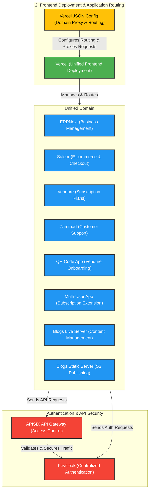
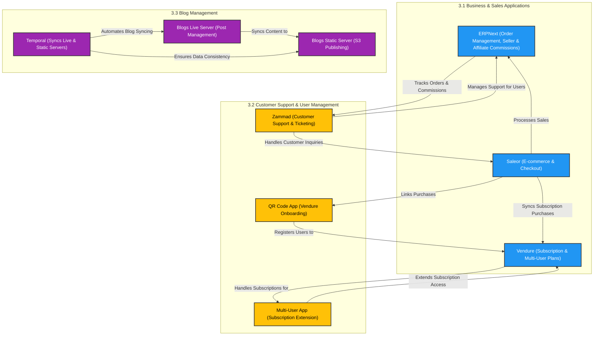
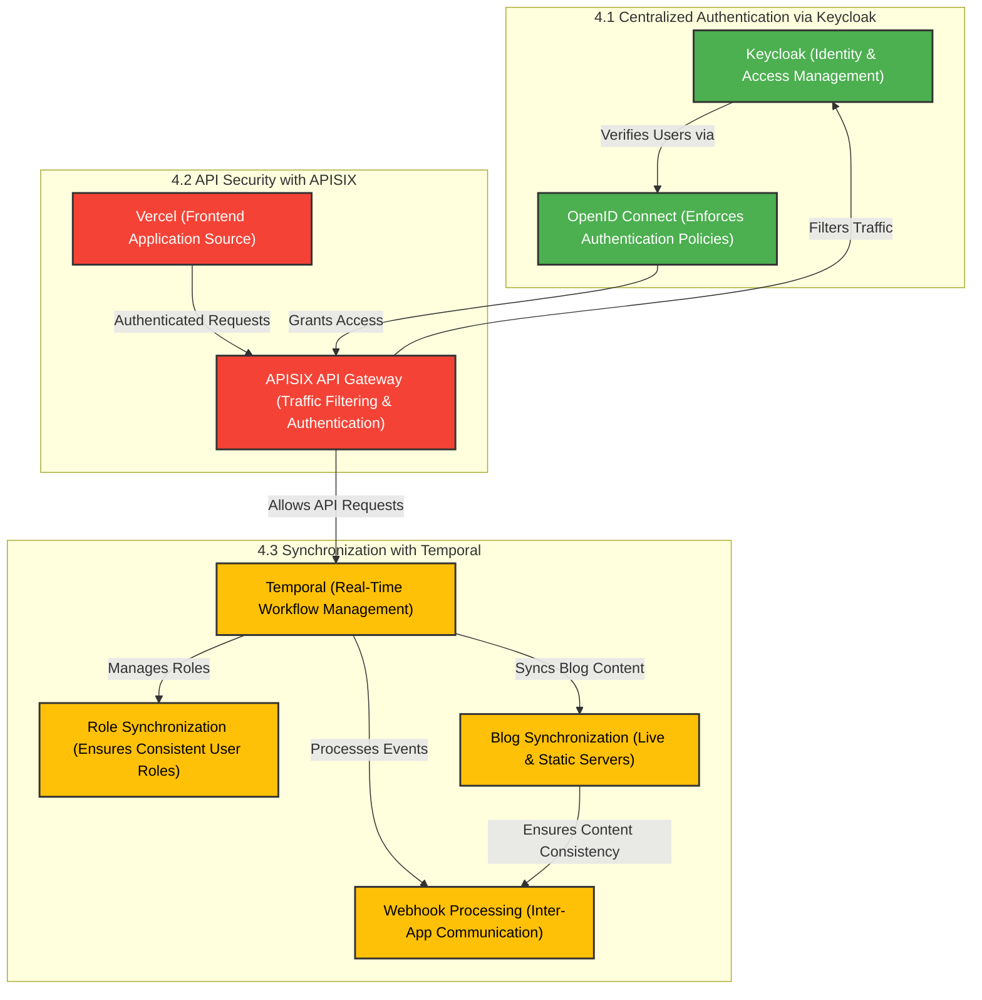
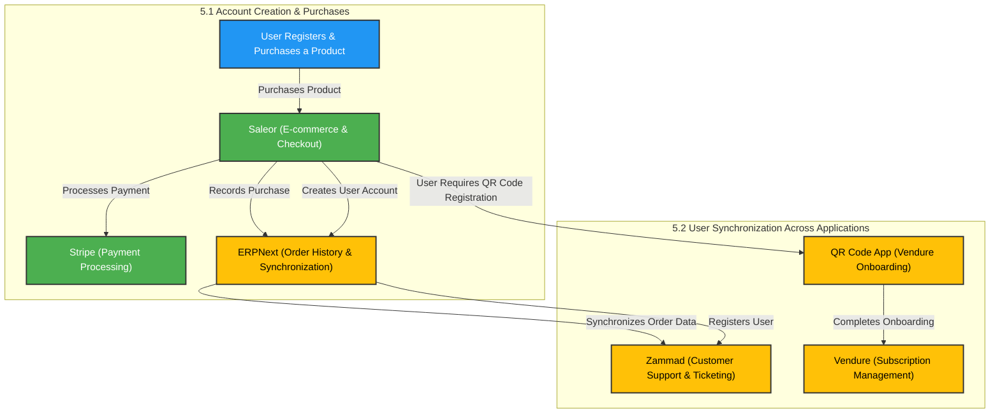
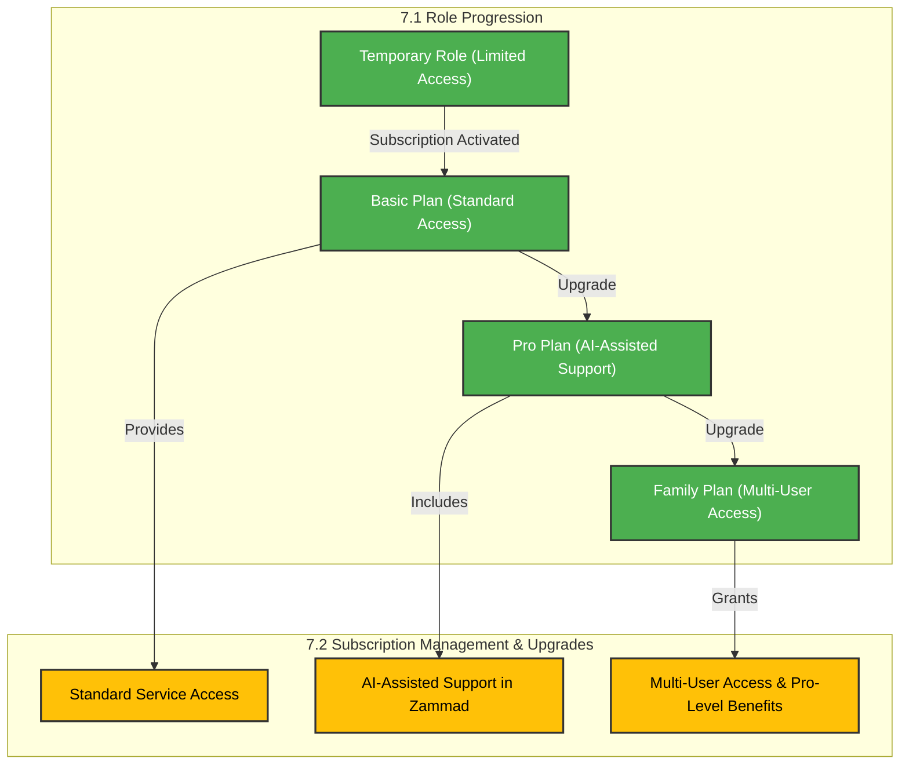
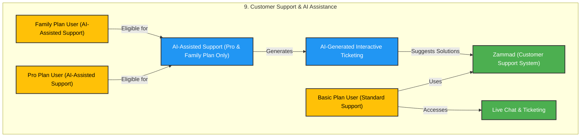
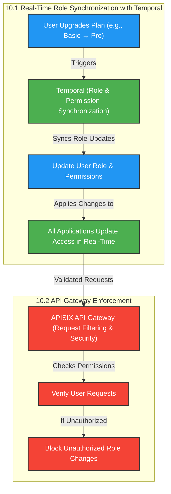

# **System Architecture and Workflow Documentation**  

## **1. Overview**  

Our **system architecture** is designed to integrate multiple applications seamlessly, allowing for efficient business operations, user authentication, subscription management, and customer support. The infrastructure is built with **modular applications**, synchronized via **Temporal workflows** and protected by **APISIX API Gateway**.  

```mermaid
flowchart TD
    %% Define Colors
    classDef appStyle fill:#2196F3,stroke:#333,stroke-width:2px,color:#fff;
    classDef securityStyle fill:#F44336,stroke:#333,stroke-width:2px,color:#fff;
    classDef syncStyle fill:#FFC107,stroke:#333,stroke-width:2px,color:#000;
    classDef infraStyle fill:#4CAF50,stroke:#333,stroke-width:2px,color:#fff;

    %% System Components
    subgraph System_Architecture["System Architecture"]
        subgraph Applications
            ERPNext["ERPNext (Business & Operations)"]:::appStyle
            Saleor["Saleor (E-commerce & Checkout)"]:::appStyle
            Vendure["Vendure (Subscription Management)"]:::appStyle
            Zammad["Zammad (Customer Support)"]:::appStyle
            QRCodeApp["QR Code App (Vendure Onboarding)"]:::appStyle
            MultiUserApp["Multi-User App (Subscription Extension)"]:::appStyle
            BlogsLive["Blogs Live Server (Content Management)"]:::appStyle
            BlogsStatic["Blogs Static Server (S3 Publishing)"]:::appStyle
        end

        subgraph Synchronization
            Temporal["Temporal Workflows (Process Automation)"]:::syncStyle
        end

        subgraph Security
            APISIX["APISIX API Gateway (Traffic & Authentication Control)"]:::securityStyle
        end

        subgraph Infrastructure
            Vercel["Vercel (Frontend Deployment & Routing)"]:::infraStyle
        end
    end

    %% Connections
    Vercel -->|Routes Requests| Applications
    Applications -->|Sync & Automate| Temporal
    Temporal -->|Ensures Workflow Execution| Applications
    Applications -->|API Requests| APISIX
    APISIX -->|Secures & Filters Traffic| Applications


```

---

## **2. Frontend Deployment and Application Routing**  

Our frontend applications are deployed via **Vercel**, enabling multiple websites and services to function under a unified domain.  

- **Vercel JSON configuration** ensures that all applications are proxied under a single domain.  
- This configuration simplifies **routing, authentication, and API access** while ensuring a seamless user experience.  

---

## **3. Applications and Their Roles**  

Our ecosystem consists of interconnected applications that facilitate business operations, sales tracking, and user management.  

### **3.1 Business & Sales Applications**  
- **ERPNext** → Core business management system handling purchase history, order processing, and seller/affiliate commissions.  
- **Saleor** → E-commerce platform managing product sales and checkout flow.  
- **Vendure** → Manages **subscription-based services** and **multi-user plans**.  

### **3.2 Customer Support & User Management**  
- **Zammad** → Ticketing and live chat system for customer support.  
- **QR Code App** → Assists with user onboarding by linking their **Saleor purchase** to a **Vendure subscription plan**.  
- **Multi-User App** → Extends **Vendure** to support **multi-user subscription plans**.  

### **3.3 Blog Management**  
The **Blogs App** consists of two **Next.js applications** for content creation and distribution:  
- **Live Server** → Allows users to create and manage posts based on their assigned permissions.  
- **Static Server** → Publishes posts to **S3**, making them publicly accessible.  
- **Temporal** ensures real-time synchronization between the **Live and Static Servers**.  

---

## **4. Authentication, Security, and Synchronization**  

### **4.1 Centralized Authentication via Keycloak**  
- **Keycloak** is the **identity and access management system**, ensuring secure authentication across all applications.  
- **OpenID Connect (OIDC)** enforces strict authentication policies.  
- **Direct login APIs** for individual applications are disabled—users must authenticate through **Keycloak**.  

### **4.2 API Security with APISIX Gateway**  
- **APISIX acts as the API Gateway**, filtering traffic and **blocking unauthorized requests**.  
- **Only requests from Vercel** with valid OIDC tokens can access the API.  

### **4.3 Synchronization with Temporal**  
**Temporal handles real-time workflows** across applications, ensuring:  
- **Consistent user role management** across all services.  
- **Automated webhook processing** for event-driven workflows.  
- **Synchronization of blog posts** between the Live Server and Static Server.  

---

## **5. User Onboarding and Purchase Flow**  

### **5.1 Account Creation & Purchases**  
- Users create an account by **purchasing a product via Saleor**.  
- **Stripe** processes all payments, as **Saleor does not handle transactions internally**.  
- Purchase records are **synchronized with ERPNext**, allowing users to **track their order history**.  

### **5.2 User Synchronization Across Applications**  
- **Users registered in Saleor** are automatically created in **ERPNext** and **Zammad**.  
- **Vendure accounts require a separate onboarding process** via **QR Code App**.  

---

## **6. Vendure Account Creation (QR Code-Based Flow)**  

To access Vendure, users must complete the **QR Code onboarding process**:  

1. **Scan QR Code**  
   - Users scan a **QR code** provided with their Saleor purchase.  
   - They are prompted to **log in or register an account**.  

2. **Accept Service Agreement**  
   - Users must **agree to the terms of service** before proceeding.  
   - A **temporary role** is assigned after agreement.  

3. **Zammad Ticket Workflow**  
   - A **support ticket is generated in Zammad** to track the onboarding process.  
   - Users **complete required steps**, such as filling out **registration forms**.  

4. **Completion & Role Assignment**  
   - Once all steps are completed, the **user is assigned their Vendure role**, allowing them to manage their subscription.  

```mermaid
flowchart TD
    %% Define Colors
    classDef qrStyle fill:#4CAF50,stroke:#333,stroke-width:2px,color:#fff;
    classDef authStyle fill:#2196F3,stroke:#333,stroke-width:2px,color:#fff;
    classDef processStyle fill:#FFC107,stroke:#333,stroke-width:2px,color:#000;
    classDef supportStyle fill:#9C27B0,stroke:#333,stroke-width:2px,color:#fff;
    classDef roleStyle fill:#F44336,stroke:#333,stroke-width:2px,color:#fff;

    %% QR Code Onboarding Process
    subgraph QR_Code_Onboarding["6. Vendure Account Creation (QR Code-Based Flow)"]
        ScanQR["1. Scan QR Code"]:::qrStyle
        UserAuth["2. Login or Register"]:::authStyle
        AcceptAgreement["3. Accept Service Agreement"]:::processStyle
        ZammadTicket["4. Zammad Ticket Generated"]:::supportStyle
        CompleteSteps["5. Complete Required Steps (Forms, Verification)"]:::processStyle
        AssignRole["6. Assign Vendure Role & Grant Access"]:::roleStyle
    end

    %% Connections
    ScanQR -->|Prompt Login/Register| UserAuth
    UserAuth -->|Verify Account| AcceptAgreement
    AcceptAgreement -->|Assign Temporary Role| ZammadTicket
    ZammadTicket -->|Track Onboarding| CompleteSteps
    CompleteSteps -->|Finalize Registration| AssignRole

```

---

## **7. Role-Based Access & Subscription Management**  

Users are **granted access** based on their role, which determines their privileges across applications.  

### **7.1 Role Progression**  
- **Temporary Role** → Assigned upon registration. Limited access.  
- **Basic Plan** → Default subscription access.  
- **Pro Plan** → Includes **AI-assisted support** in Zammad.  
- **Family Plan** → Enables **multi-user access**, allowing the primary user to **invite additional members**.  

### **7.2 Subscription Management & Upgrades**  
| **Plan** | **Features** |
|---------|-------------|
| **Basic** | Default plan with standard access to services. |
| **Pro** | Unlocks AI-assisted support in Zammad. |
| **Family** | Enables multi-user access and Pro-level benefits for all invited members. |

---

## **8. Affiliate & Seller Commission Tracking**  

### **8.1 Seller & Influencer Tracking in ERPNext**  
- **ERPNext automatically tracks all sales** generated by sellers and influencers.  
- Sellers can access a **dedicated UI** to:  
  - View sales and commissions.  
  - Track **invoice payments** and **withdrawals**.  

### **8.2 Affiliate Marketing via Promo Codes**  
- **Affiliates receive unique promo codes** to distribute.  
- When a purchase is made using a promo code:  
  - **ERPNext records the transaction**.  
  - The sale is **attributed to the affiliate**.  

**Affiliates can access a commission dashboard**, displaying:  
- **Earnings summary**  
- **Sales reports**  
- **Payout history**  

```mermaid
flowchart TD
    %% Define Colors
    classDef trackingStyle fill:#4CAF50,stroke:#333,stroke-width:2px,color:#fff;
    classDef commissionStyle fill:#2196F3,stroke:#333,stroke-width:2px,color:#fff;
    classDef payoutStyle fill:#FFC107,stroke:#333,stroke-width:2px,color:#000;

    %% Seller & Influencer Tracking in ERPNext
    subgraph Seller_Tracking["8.1 Seller & Influencer Tracking in ERPNext"]
        SalesTracked["Sales Tracked in ERPNext"]:::trackingStyle
        SellerUI["Seller Dashboard (View Sales & Commissions)"]:::commissionStyle
        InvoiceTracking["Track Invoice Payments & Withdrawals"]:::payoutStyle
    end

    %% Affiliate Marketing via Promo Codes
    subgraph Affiliate_Tracking["8.2 Affiliate Marketing via Promo Codes"]
        PromoCode["Affiliate Promo Code Issued"]:::trackingStyle
        PurchaseMade["Purchase Made Using Promo Code"]:::trackingStyle
        RecordSale["ERPNext Records Sale & Assigns to Affiliate"]:::commissionStyle
        AffiliateDashboard["Affiliate Dashboard (Earnings, Sales Reports, Payout History)"]:::payoutStyle
    end

    %% Connections
    SalesTracked -->|Syncs Data| SellerUI
    SellerUI -->|Tracks| InvoiceTracking

    PromoCode -->|Used by Customer| PurchaseMade
    PurchaseMade -->|Logs Sale in ERPNext| RecordSale
    RecordSale -->|Updates| AffiliateDashboard


```

---

## **9. Customer Support & AI Assistance**  

- **Zammad handles customer support** via chat and ticketing.  
- **AI-assisted support** is available for **Pro Plan and Family Plan users only**.  
- **Users with AI-assisted support can generate interactive tickets**, allowing the AI to suggest solutions.  

---

## **10. Role & Permission Flow Management**  

### **10.1 Real-Time Role Synchronization with Temporal**  
- **Temporal ensures automatic role updates** across applications.  
- When a **user’s plan is upgraded** (e.g., from Basic to Pro):  
  - **All applications update access permissions in real-time**.  

### **10.2 API Gateway Enforcement**  
- **APISIX ensures only verified user requests** reach backend services.  
- Unauthorized role modifications are **automatically blocked**.  

